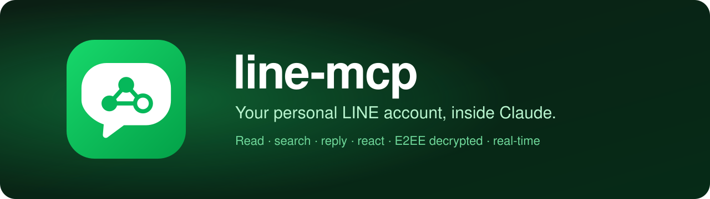
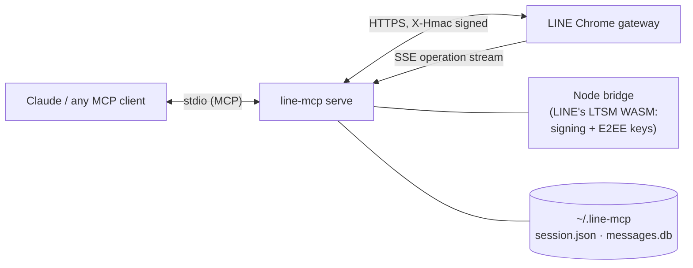

<p align="center">
  
</p>

<p align="center">
  <a href="#quick-start"></a>
  <a href="https://modelcontextprotocol.io/"></a>
  <a href="LICENSE"></a>
  
</p>

<p align="center">
  <b>An <a href="https://modelcontextprotocol.io/">MCP</a> server for your <i>personal</i> LINE account.</b><br>
  Read, search and answer your chats from Claude — end-to-end-encrypted messages and media included.
</p>

<p align="center">
  <a href="#quick-start">Quick start</a> ·
  <a href="#what-you-can-ask">What you can ask</a> ·
  <a href="#tools">Tools</a> ·
  <a href="#how-it-works">How it works</a> ·
  <a href="#privacy--safety">Privacy &amp; safety</a> ·
  <a href="#troubleshooting">Troubleshooting</a>
</p>

> [!WARNING]
> **Unofficial — use at your own risk.** This is built on [okline](https://github.com/nicedayzc/okline), which reproduces the protocol of the LINE Chrome extension. It isn't affiliated with or endorsed by LY Corporation, and unofficial clients can get an account restricted. It logs in as a **companion device**, so your phone stays logged in. The server rate-limits itself, but keep your usage human-like.

## What you can ask

Once it's connected, just talk to Claude:

- *"What did I miss on LINE today?"*
- *"Summarize the family group chat from this week."*
- *"Find the message where Sarah sent the restaurant address."*
- *"Show me the photo Ken sent this morning."* (encrypted images are decrypted)
- *"Has everyone in the team group read my last message?"*
- *"Reply 'on my way 🙏' to Mai's last message."* (Claude asks you first)
- *"Wait for a reply from the landlord and tell me when it comes."*

## Features

- 💬 **Chats & messages.** Contact and group names, sender names (even for group members who aren't your friends), replies, stickers, files, locations, and paging back through history.
- 🔐 **End-to-end encryption.** Letter Sealing messages *and media* are decrypted locally, including the messages you sent yourself.
- 🔎 **Instant search.** A local store of every message the server has seen. Substring search works for Thai, Japanese and other scripts without word spacing.
- ⚡ **Real time.** Subscribes to LINE's operation stream (like the Chrome extension does) for new messages, unsends and read notices, and catches up after a restart.
- ✍️ **Acting as you.** Text, replies, photos, videos, files, voice messages, stickers, reactions, unsend and mark-read. All of these are flagged as write tools, so your client asks before using them.
- 👀 **Read receipts.** Who has read what, and when.
- 🔑 **Login from the chat.** When the session expires, Claude shows the QR code right in the conversation.
- 🛡️ **Careful by default.** About 4 requests per second, at most 10 outgoing actions per minute, key caching, and secrets stored `600`.

## Quick start

You need [Node.js](https://nodejs.org/) 18+ installed (LINE's request signing runs in it). Then pick the option that fits how you work.

### Option 1: Claude Desktop, one click

1. Download **[`line-mcp.mcpb`](https://github.com/itsloukman/line-mcp/releases/latest/download/line-mcp.mcpb)** and double-click it. Claude Desktop installs everything, including Python.
2. In a new chat, say **"log me in to LINE"**. Claude shows a QR code; scan it with LINE on your phone (Home → QR scanner), then type the PIN Claude gives you.

That's it, no terminal needed.

### Option 2: any app, one command

```bash
uv tool install git+https://github.com/itsloukman/line-mcp   # or: pipx install git+https://github.com/itsloukman/line-mcp
line-mcp setup
```

`setup` checks Node, logs you in (QR in the terminal), detects your MCP apps and adds itself to the ones you choose. It supports **Claude Desktop, Claude Code, OpenAI Codex, Cursor, Windsurf, VS Code and Gemini CLI**. Existing config files are merged, never overwritten, and backed up as `*.bak-line-mcp`.

To target specific apps later:

```bash
line-mcp install codex cursor      # or: --all
line-mcp uninstall cursor
line-mcp install --print           # print a JSON snippet for any other client
```

### Option 3: configure by hand

Each snippet uses `uvx` to run straight from GitHub, so there's nothing to install except [uv](https://docs.astral.sh/uv/). Log in first with `uvx --from git+https://github.com/itsloukman/line-mcp line-mcp login`, or ask your assistant to "log me in to LINE".

<details>
<summary><b>Claude Code</b></summary>

```bash
claude mcp add --scope user line-personal -- uvx --from git+https://github.com/itsloukman/line-mcp line-mcp serve
```
</details>

<details>
<summary><b>OpenAI Codex</b> (<code>~/.codex/config.toml</code>)</summary>

```toml
[mcp_servers.line-personal]
command = "uvx"
args = ["--from", "git+https://github.com/itsloukman/line-mcp", "line-mcp", "serve"]
```
</details>

<details>
<summary><b>Claude Desktop, Cursor, Windsurf, Gemini CLI</b> (JSON)</summary>

Paste into `claude_desktop_config.json`, `~/.cursor/mcp.json`, `~/.codeium/windsurf/mcp_config.json` or `~/.gemini/settings.json`:

```json
{
  "mcpServers": {
    "line-personal": {
      "command": "uvx",
      "args": ["--from", "git+https://github.com/itsloukman/line-mcp", "line-mcp", "serve"]
    }
  }
}
```

GUI apps start servers with a minimal `PATH`. If yours can't find `uvx`, use its absolute path (`which uvx`).
</details>

<details>
<summary><b>VS Code</b> (<code>mcp.json</code>)</summary>

```json
{
  "servers": {
    "line-personal": {
      "type": "stdio",
      "command": "uvx",
      "args": ["--from", "git+https://github.com/itsloukman/line-mcp", "line-mcp", "serve"]
    }
  }
}
```
</details>

> [!NOTE]
> **Why isn't this a "custom connector"?** Custom connectors in the Claude app are *remote* servers you add by URL. line-mcp runs **locally on purpose**: your LINE login keys and decrypted messages never leave your computer. The one-click `.mcpb` extension (Option 1) is the local equivalent.

## Tools

Read tools carry `readOnlyHint`, so clients can auto-approve them. Everything that acts as you is a write tool, so the client asks first. Tools run in worker threads, so a slow search or wait never blocks the others.

<details>
<summary><b>Reading</b> (17 tools)</summary>

| Tool | What it does |
|---|---|
| `line_whoami` | Profile, E2EE status, local store and live-sync status |
| `line_chats(limit?)` | Recent chats with names, unread counts and a last-message preview |
| `line_read(chat_id, count?, before_message_id?)` | Messages, decrypted, oldest first. Pass the oldest id as `before_message_id` to page back |
| `line_get_chat` · `line_contact_chats` · `line_last_interaction` | Chat info, find a DM, the latest message with a contact |
| `line_message_context(chat_id, message_id, before?, after?)` | The messages around a specific message |
| `line_search_messages(query, chat_id?, limit?)` | Substring search over everything stored, newest first |
| `line_sync_history(chat_id, max_messages?)` | Pull a chat's history into the store so search covers it |
| `line_new_messages(since_minutes?, chat_id?, include_mine?)` | What arrived recently |
| `line_wait_for_message(timeout_seconds?, chat_id?)` | Wait for the next incoming message |
| `line_read_receipts(chat_id, message_id?)` | Who has read the chat, and up to where |
| `line_find_contact` · `line_groups` · `line_group_members` | Contacts, groups and group members (with names) |
| `line_get_image(message_id, chat_id?)` | An image message, returned as an image (E2EE decrypted) |
| `line_download_media(message_id, chat_id?, save_dir?, file_name?)` | Any media, saved to disk (E2EE decrypted) |
</details>

<details>
<summary><b>Acting as you</b> (8 tools, all require your approval; at most 10 per minute)</summary>

| Tool | What it does |
|---|---|
| `line_send(chat_id, text, reply_to_message_id?)` | Send a text, optionally as a reply |
| `line_send_file(chat_id, file_path, duration_ms?)` | Photo, video or document (photos arrive as photos) |
| `line_send_voice(chat_id, audio_path, duration_ms?)` | Voice message |
| `line_send_sticker(chat_id, package_id, sticker_id)` | Sticker (only packs you own) |
| `line_react` · `line_unreact` | 👍 nice · ❤️ love · 😆 fun · 😮 amazing · 😢 sad · 😱 omg |
| `line_unsend(message_id)` | Recall one of your messages for everyone |
| `line_mark_read(chat_id)` | Mark a chat read. **This sends read receipts** |
</details>

<details>
<summary><b>Login</b> (2 tools)</summary>

`line_login_start` returns the QR code as an image in the chat. `line_login_status` reports progress and gives the PIN to type on your phone. Logging in again usually skips the PIN.
</details>

## How it works



- **Login** replays the LINE Chrome extension's QR flow. Your phone approves this computer as a companion device and hands it the Letter Sealing keychain, which is stored in `session.json`.
- **Requests** are signed by LINE's own WASM module, run in a small Node.js process. That's why Node is required.
- **E2EE** messages are decrypted locally. Media is downloaded and decrypted the same way the extension does it (HKDF → AES-CTR plus an HMAC check).
- **Live sync** follows LINE's operation stream, saving its position so it can resume after a restart. A once-a-minute check fills the gaps, such as messages you send from your phone.

## Privacy & safety

- **Everything stays on your machine.** There's no third-party server; the only network traffic goes to LINE.
- **`~/.line-mcp/` holds secrets.** `session.json` has your tokens and E2EE private keys, and `messages.db` has decrypted message text. Both are created mode `600` in a `700` directory. Never commit or share them.
- **Don't want a local copy?** Set `LINE_MCP_STORE=off` to disable the message store. You lose search history, new-message queries and waiting.
- **For agent builders:** treat every write tool as acting in the user's name. Get explicit approval of the exact text or action, every time.

## Configuration

| Variable | Default | Purpose |
|---|---|---|
| `LINE_SESSION_PATH` | `~/.line-mcp/session.json` | Where the login session lives |
| `LINE_NODE` | auto-detected | Path to `node` (checks `PATH`, Homebrew, `/usr/local/bin`, `~/.local/bin`, volta, nvm, fnm) |
| `LINE_MCP_STORE` | `on` | `off` disables the local message store |
| `LINE_MCP_DB` | `~/.line-mcp/messages.db` | Where the store lives |
| `LINE_MCP_POLL_SECONDS` | `60` | How often the backup check runs |
| `LINE_MAX_SENDS_PER_MIN` | `10` | Cap on outgoing actions |

## Troubleshooting

Run `line-mcp doctor` first. It checks Node, the session file and its permissions, the login, the E2EE keys and the store.

| Symptom | Fix |
|---|---|
| *"Node.js not found"* | Install Node 18+, or set `LINE_NODE=/absolute/path/to/node` in the server's `env` |
| *"LINE rejected the session"* | Ask Claude to log you in (`line_login_start`), or run `line-mcp login` |
| Messages show *"[encrypted message — could not decrypt]"* | The E2EE keys are missing or stale. Log in again |
| *"only send stickers you own"* | LINE only allows stickers from packs in your collection |
| The QR code expired | They last about 2 to 3 minutes. `login` keeps generating fresh ones for 10 minutes |

## Limits

- **History:** LINE serves a companion device only about the last two weeks of history. Anything older is only searchable if the store saw it while it was recent.
- **Stickers:** you can only send stickers from packs you own.
- **Groups:** okline can't create a group's *first* E2EE key, so sending into a sealed group that has never had an encrypted message may fail.
- **okline version:** pinned to `<2.8`, because this server patches parts of okline's E2EE internals.

## Development

```bash
# build the Claude Desktop extension: npx @anthropic-ai/mcpb pack . dist/line-mcp.mcpb

git clone https://github.com/itsloukman/line-mcp && cd line-mcp
uv venv venv && uv pip install -p venv/bin/python -e '.[test]'
venv/bin/python -m pytest -q        # offline tests, no LINE account needed
```

## Credits & license

MIT. Built on [okline](https://github.com/nicedayzc/okline); check its license and terms too. LINE is a trademark of LY Corporation. This project is not affiliated with it, and the logo is original artwork.
